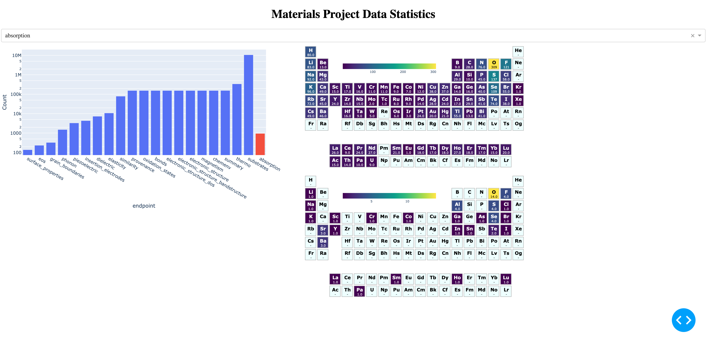

## Materials Project Data Statistics App

This app offers an overview of Materials Project data, including 
- the data size of API endpoints 
- the distribution of chemical elements for each API.

### Overview



### Usage

1. **Create a virtual environment:**

    ```bash
    python3.11 -m venv .env
    source .env/bin/activate
    ```
    
2. **Install required packages:**

    ```bash
    pip3 install -r requirements.txt
    ```

3. **Run the main application:**

    ```bash
    python3 MP_data_stats.py 
    ```


TODO:
- add description
